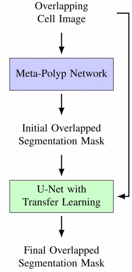
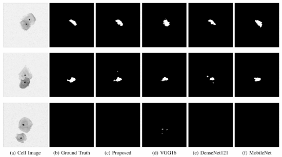
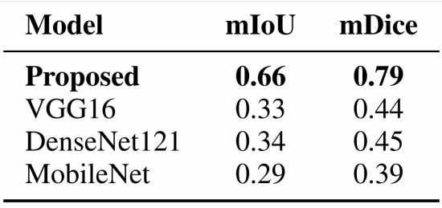

# Overlapping Cervical Cell Region Segmentation

## Introduction
This repository contains the code implementation in the form of google colab notebook 'Cervical_overlapped_seg.ipynb' for the paper *"Overlapping Cervical Cell Region Segmentation"* by Shaad Fazal and Richard M. Dansereau, presented at the 2024 IEEE International Symposium on Medical Measurements and Applications (MeMeA). 

Deep learning algorithms have made phenomenal inroads into the domain of medical image formation and analysis, including in the segmentation of cervical cell cytology images. Cervical cancer is one of the most common cancers affecting women worldwide. Medical imaging plays a pivotal role in the detection and diagnosis of cervical cancer. Segmentation of overlapping cells is one of the major challenges in analyzing these images due to the varying contrast of cell cytoplasm and a wide range of cell overlap ratios. The next step in this domain is to segment the overlapped portion of cervical cells to harness the full scope of cellular information.

We propose to adopt the Meta-Polyp segmentation method for our task, which combines the MetaFormer baseline model elements, such as neural network transformers with U-Net architecture, with some minor tweaks in hyperparameters. The Meta-Polyp neural network is able to capture the overlapped region of cervical cells to an extent. We then refine our segmentation results by applying a modified U-Net neural network that employs transfer learning in its encoder stage to obtain the final segmentation masks. Using this novel deep learning image segmentation pipeline, we achieve accurate results for the segmentation of the overlapped region of cervical cells.

This work takes inspiration from the Meta-Polyp model developed by Quoc-Huy Trinh for polyp segmentation:

> Q. Trinh, "Meta-Polyp: A Baseline for Efficient Polyp Segmentation," *2023 IEEE 36th International Symposium on Computer-Based Medical Systems (CBMS)*, pp. 742-747. [Link to MetaPolyp Repository](https://github.com/huyquoctrinh/MetaPolyp-CBMS2023).

## Architecture
The proposed architecture leverages a cascaded neural network architecture employing the Meta-Polyp network followed by a modified U-Net neural network, to enhance segmentation performance for overlapped portion of cervical cells. Below is a schematic representation of the architecture used in this study.



## Results

### Qualitative Results
We present the qualititave results of segmentation of overlapped portion of cervical cells using our proposed method. Our model demonstrates significant accuracy in segmenting the overlapped portions of cervical cells. 



### Quantitative Results
The model achieved promising metrics in terms of segmentation accuracy, as summarized in the table below.



## Citation

If you use this code in your research, please cite our paper as follows:

### BibTeX
```bibtex
@INPROCEEDINGS{10596808,
    author={Fazal, Shaad and Dansereau, Richard M.},
    booktitle={2024 IEEE International Symposium on Medical Measurements and Applications (MeMeA)}, 
    title={Overlapping Cervical Cell Region Segmentation}, 
    year={2024},
    pages={1-6},
    keywords={Deep learning;Image segmentation;Microprocessors;Neural networks;Transfer learning;Pipelines;Computer architecture;Overlapping cervical cell region segmentation;medical image analysis;machine learning;U-Net},
    doi={10.1109/MeMeA60663.2024.10596808}
}
